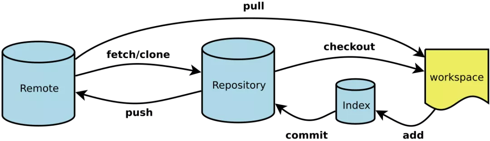
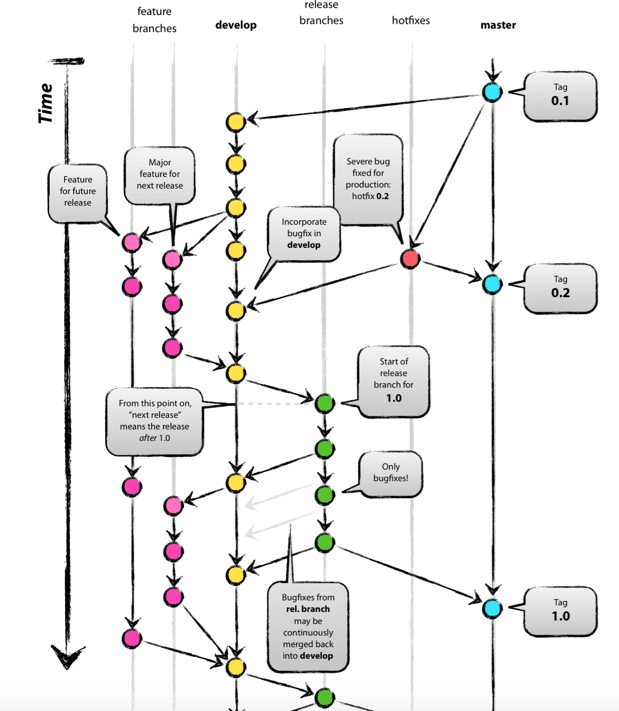

# Git



## 相关术语

`Repository 本地仓库`、`Remote 远程仓库`、`branch 分支`、`summary 摘要`、`track 跟踪`、`modify 修改`、`Workspace 工作区`、`Index/Stage 暂存区`、`commit 提交`、`push 推送`、`pull 拉取`、`clone 克隆`、`amend 修改`、`merge 合并`、`conflict 冲突`、`origin 源`、`upstream 上游`、`downstream 下游`、`verbose 详情`、`reflog 参照日志`

## 基本操作

- 初始化新仓库

```bash
git init
```

- 查看文件状态

```bash
git status 
```

- 文件跟踪

```bash
git add xxx         //跟踪某个文件
git add .           //批量跟踪
```

- 文件提交本地仓库

```bash
git commit              //提交文件到本地仓库
git commit -m 'xxx'     //xxx是你本次提交的信息说明
git commit -am 'xxx'    //将所有已跟踪的文件暂存起来一并提交
```

- 推送远程仓库

```bash
git push origin xxx

// 可以通过 -u 指定一个默认的源 
git push -u origin xxx
// 这样以后 push 就不用加 origin
git push
```

- 拉取远程仓库

```bash
git pull origin xxx
// 可以简写 git pull， 如果提示no tracking information， 我们可以通过下面方法建立追踪，后续就可以直接 git pull了
git branch --set-upstream branch-name origin/branch-name
```

- 差异比较

```bash
git diff
```

- 查看提交历史

```bash
git log            //按提交时间列出所有的更新，最近的更新排在最上面
git log --oneline  //查看简要的历史记录
git reflog         //用来记录每一次命令， 常用来辅助版本切换
```

## 分支管理

**新建与删除分支：**

我们一般开发时都会从`master`分支分离出一个`dev`或者其他用来开发的分支， 这样即使开发出现问题也不会影响主分支。

使用`git branch xxx`创建一个新的分支。

使用`git checkout xxx`切换到新的分支。

`branch, checkout`常用命令:

```bash
git checkout -b xxx         // 可以快速新建并切换到新的分支

git branch -d xxx           // 当分支合并到主分支， 这个分支就可以通过-d删除了

git branch -D xxx           // 删除那些没有被合并的分支

git branch -a               // 查看所有分支

git branch -vv              // 查看当前的本地分支与远程分支的关联关系
```

**分支合并：**

**注意： 分支合并时， 你一定要保证你在要合并到这个分支的目标分支上**

使用`git merge xxx`即可将xxx分支合并到你当前所在的分支。

如果在分支合并时，不同的分支修改了同一个文件的同一部分， 此时 git 是无法判断该使用哪个分支的代码的， 这样就会产生冲突，虽然 git 进行了合并， 但并没有提交，需要我们解决冲突后再重新提交。

我们可以通过`git status`查看是哪些文件发生了冲突，然后逐一解决， 把冲突的代码按正确的代码修复后， 需要重新`add`, `commit`, `push`。

## 远程仓库

**克隆远程仓库：**

通过`git clone url`来克隆远程仓库

```bash
// 默认会在拉取的路径下新建一个 blog-mason 的文件夹
git clone https://github.com/MasonEast/blog-mason.git   

// 如果不想要文件夹 blog-mason，可以在url后面，空格加上新名字
git clone https://github.com/MasonEast/blog-mason.git newName

// 如果就想要在当前路径下放项目文件， 不要那个外面的文件夹，直接在后面加点 .
git clone https://github.com/MasonEast/blog-mason.git .
```

**查看远程仓库：**

我们克隆的仓库通过`git remote`会看到一个叫 origin 的远程库， 这是 git 默认标识克隆的原始仓库。

通过`git remote -v`或`git remote --verbose`我们可以查看到更加详细的信息，即对应的项目地址， 正常会有两个， 但如果你没有 push 权限的话就只能看到一个fetch的地址。

```bash
git remote -v

origin  git@github.com:W-Qing/Notes.git (fetch)
origin  git@github.com:W-Qing/Notes.git (push)
```

**删除远程分支：**

```bash
git push origin :xxx
//也可以
git push origin --delete xxx
```

**删除远程仓库：**

```bash
git remote rm xxx
```

**重命名远程仓库：**

```bash
git remote rename oldName newName
```

## 关于误操作

git 主要用于版本控制， 协同开发， 误操作可以撤销， 但是**有的撤销是不可逆的， 我们一定要慎重对待， 不然可能导致部分代码丢失。**

**移除暂存区的文件：**

场景： 有时候我们习惯性的使用`git add .`把所有修改的文件都提交到暂存区， 但有些文件是我们不应该提交的， 这时要从暂存区中移除文件。

```bash
git reset HEAD xxx      // xxx文件名
```

**移除本地仓库的文件：**

场景： 如果我们不但`git add XXX`将文件添加到暂存区了，而且还`git commit`将其提交到本地仓库后， 才想起来它是多余的想取出来。

```bash
git rm xxx  
```

**修改最后的一次提交：**

场景： 某次提交完后， 发现少提交了文件或者是最近一次提交的代码有问题怎么办？比起简答粗暴的再提交一次，更优雅的方式是：不进行再一次提交，而是修改这次提交。

```bash
git add xxx             // 添加少提交的或修改的文件到暂存区
git commit --amend      // 往最后一次提交中追加少提交的文件，并修正提交信息

git commit --amend --no-edit
// 快捷方式， 使用 --no-edit 参数，它表示提交信息不会更改，在 git 上仅为一次提交。
```

> 【amend】修正，会对最新一条 commit 进行修正，会把当前 commit 里的内容和暂存区（stageing area）里的内容合并起来后创建一个新的 commit，用这个新的 commit 把当前 commit 替换掉。
>
> 输入上面的命令后，Git 会进入提交信息编辑界面，然后你可以删除之前的 changeId，并且修改或者保留之前的提交信息，:wq 保存按下回车后，你的 commit 就被更新了。

tips: 刚刚提交的代码文件没问题，只是提交信息写的有问题，该怎么修改？

```bash
git commit --amend -m "新的提交信息"
```

**关于暂存的问题**

假如正在开发手中的某个需求，这是突然又来了个紧急 bug 需要修复，这时候需要先 stash 已经写的部分代码，使自己返回到上一个 commit 版本，改完 bug 之后再从缓存栈中推出之前未写完的代码，继续工作。

```bash
git stash // 添加缓存栈
git stash list // 查看缓存栈
git stash pop // 推出缓存栈
git stash apply stash@{1} // 取出特定缓存内容
```

没有被 track 的文件（即从来没有被 add 过的文件不会被 stash 起来，因为 Git 会忽略它们。如果想把这些文件也一起 stash，可以加上 `-u` 参数。它是 `--include-untracked` 的简写。就像这样：`git stash -u`

## 提交规范

这个就是见仁见智啦，常用的几种提交格式类型：

- feat：新功能（feature）
- fix：修补 bug
- docs：文档（documentation）
- refactor: 重构（既不是新增功能，也不是修改bug而是优化现有项目的代码变动）
- test：测试
- chore：其他修改，比如构建过程或辅助工具的变动

## 开发实践



### Branchs

**master branch:** from begining

**develop branch:** from begining

 **release(test) branch**: branch from develop, merge back to develop and master, and make tag(version) on master

Next is optional:

**feature branch:**  branch from develop, merge back to develop

**hotfixes branch:** branch from master, merge back to develop and master, and make tag(version) on master

### Flow

1. step1. **owner** init repo, create master branch, and dev branch from master
2.  step2. **developer** git clone the repo, switch to dev branch to develop
   -  option1: start multiple features at the same time, developer can start feature1 branch, feature2 branch in the local branch, merge back to dev branch after development, push to origin/dev, and finally you can choose to delete or keep these feature branches
   - option2: develop directly on dev branch, commit, and finally push to origin/dev
   - option3: maintain a branch development of your own, merge to dev and then push before uploading
3.  step3. **owner** branch release(test) branch when iteration ends. maintain the version.
4.  step4. **developer** continue develop on dev branch, fix bugs on release(test) branch.
5.  step5. when the release(test) branch is ready(no severe bug), **owner** merge to master branch, tag the version, owner merge to dev branch.
6.  step6. when there are any bugs after release to user. developer make hotfixes branch，after test, merge to dev branch and master branch.