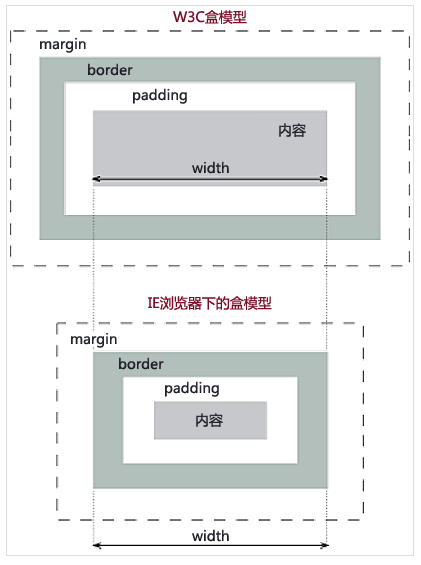

# CSS

## 使用 link 和@import 导入样式有什么区别？🌟

- link 属于 XHTML 标签，而@import 是 CSS 提供的。
- 页面被加载时，link 会同时被加载，而@import 引用的 CSS 会等到页面被加载完再加载。
- import 只在 IE 5 以上才能识别，而 link 是 XHTML 标签，无兼容问题。
- link 方式的样式权重高于@import 的权重。
- 使用 dom 控制样式时的差别。当使用 javascript 控制 dom 去改变样式的时候，只能使用 link 标签，因为@import 不是 dom 可以控制的。

## CSS 选择器的权重和优先级？

CSS 选择器有很多，不同的选择器的权重和优先级不一样，对于一个元素，如果存在多个选择器，那么就需要根据权重来计算其优先级。

权重分为四级，分别是：

1. 代表内联样式，如`style="xxx"`，权值为 1000。
2. 代表 ID 选择器，如`#content`，权值为 100。
3. 代表类、伪类和属性选择器，如`.content`、`:hover`、`[attribute]`，权值为 10。
4. 代表元素选择器和伪元素选择器，如`div`、`p`，权值为 1。

**简单记忆：内联 > ID 选择器 > 类选择器 > 标签选择器**

**需要注意的是：通用选择器（\*）、子选择器（>）和相邻同胞选择器（+）并不在这四个等级中，所以他们的权值都为 0**。 

权重值大的选择器其优先级也高，相同权重的优先级又遵循后定义覆盖前面定义的情况。

## 伪类和伪元素的区别是什么？

**伪类**是一个以冒号` : `作为前缀，被添加到一个选择器末尾的关键字。存在的意义就是为了通过选择器找到那些不存在 DOM 树中的信息以及不能被常规 CSS 选择器获取到的信息。

> 当你希望样式在特定状态下才被呈现到指定的元素时，你可以往元素的选择器后面加上对应的伪类。比如` :checked`、`:hover`、`:visited`、`:first-child`

**伪元素**用于创建一些不在文档树中的元素，并为其添加样式。比如说，我们可以通过` ::before `来在一个元素前增加一些文本，并为这些文本添加样式。虽然用户可以看到这些文本，但是这些文本实际上不在文档树中。

**两者的区别？**

css 引入伪类和伪元素概念是为了格式化文档树以外的信息。也就是说，伪类和伪元素都是用来修饰不在文档树中的部分。

**而伪类与伪元素的区别在于：有没有创建一个文档树之外的元素。**

> 比如：`p::before`对这段文本添加了额外的元素，通过 `p:first-child`改变了文本的样式。

伪类是通过在元素选择器上加入伪类改变元素状态，而伪元素通过对元素的操作进行对元素的改变。

> **`::after` 和 `:after` 的区别**
>
> 在实际的开发工作中，我们会看到有人把伪元素写成`:after`，这实际是 CSS2 与 CSS3 新旧标准的规定不同而导致的。
>
> CSS2 中的伪元素使用 1 个冒号，在 CSS3 中，为了区分伪类和伪元素，规定伪元素使用 2 个冒号。所以，对于 CSS2 标准的老伪元素，比如`:first-line`，`:first-letter`，`:before`，`:after`，写一个冒号浏览器也能识别，但对于 CSS3 标准的新伪元素，比如`::selection`，就必须写 2 个冒号了。
>
> 拓展阅读：[伪类与伪元素](http://www.alloyteam.com/2016/05/summary-of-pseudo-classes-and-pseudo-elements/)

## 对盒模型的理解？🌟

当浏览器对一个网页文档进行布局（layout）的时候，其渲染引擎会根据标准之一的 CSS 基础框盒模型（CSS basic box model），将所有元素表示为一个个矩形的盒子（box）。CSS 决定这些盒子的大小、位置以及属性（例如颜色、背景、边框尺寸…）。


盒模型由 content（内容）、padding（内边距）、border（边框）、margin（外边距）四部分组成。

## 标准盒模型和怪异盒模型有什么区别？🌟

### 这个问题其实也就是在问两种盒子模型的宽度如何计算？

**在 W3C 标准下的标准盒模型中，我们设置的元素宽度值 width 都是内容 content 的宽度，而不是整个盒子的宽度。（高度同理）**

**因此标准盒模型的盒子宽度是：（内容宽度 + padding 宽度 + border 宽度 + margin 宽度）之和。**

这样我们改四个中的任何一个，都会导致盒子总宽度的改变。这对我们开发来说并不友好。



**而在 IE 怪异盒模型（IE8 以下）中，我们书写的宽度值并不是内容 content 的宽度，而是 border-left + padding-left + content 的宽度值 + padding-right + border-right 之和，height 同理。**

**因此怪异盒模型的盒子宽度是：内容宽度 + padding 宽度 + border 宽度（不包括 margin）。**

这样就比较符合我们的实际开发要求了。因此虽然现代浏览器默认使用 W3C 的标准盒模型，但是在不少情况下怪异盒模型更加好用，于是 W3C 在 css3 中加入了`box-sizing`。

```css
box-sizing: content-box // 标准盒模型
box-sizing: border-box // 怪异盒模型
box-sizing: padding-box // 火狐的私有模型，没人用
```

## 谈谈对 BFC 的理解？🌟

**块级上下文格式化 BFC (Block Formatting Context)**  

**BFC 是 Web 页面中盒模型布局的 CSS 渲染模式，指一个独立的渲染区域或者说是一个隔离的独立容器。**

在这个独立的渲染区域里，只有 Block-level Box 参与， 并且它有一套渲染规则规定了内部的块级子元素如何布局，以及和其他元素的关系和相互作用。这套规则让处于 BFC 内部的元素与外部的元素互相隔离，毫不相关。

**BFC 的特性：**

- 内部的 Box 会在垂直方向上一个接一个的放置。
- 垂直方向上的距离由 margin 决定
- bfc 的区域不会与 float 的元素区域重叠
- 计算 bfc 的高度时，浮动元素也参与计算
- bfc 就是页面上的一个独立容器，容器里面的子元素不会影响外面元素

**BFC 的应用：**

- 防止 margin 发生重叠 
- 防止元素塌陷
- 清除内部浮动
- 自适应两（多）栏布局
- 防止文字环绕

**触发 BFC 的条件：**

- 根元素，即 HTML 元素
- position 的值为 absolute、fixed
- float 的值不为 none
- overflow 的值不为 visible
- display 的值为 inline-block、table-cell、table-caption

## CSS 有几种定位方式？

1. **static：** 默认值，正常文档流定位，此时 top、right、 bottom、left 和 z-index 属性无效，块级元素从上往下纵向排布，行级元素从左向右排列。

2. **relative：** 相对定位，此时的『相对』是相对于正常文档流的位置。**会导致自身位置的相对变化，而不会影响其他元素的位置、大小**。这是 relative 的要点之一。还有第二个要点，就是 relative **产生一个新的定位上下文**。

3. **absolute：** 相对于最近的非 static 定位祖先元素的偏移，来确定元素位置。比如一个绝对定位元素它的父级、和祖父级元素都为 relative，它会相对他的父级而产生偏移。

   > 1. 和 relative 不同，absolute 元素脱离了文档结构，会产生破坏性，导致父元素坍塌。
   > 2. absolute 元素具有“包裹性”。之前撑满整个屏幕的宽度值会变成刚好是内容宽度的宽度值。
   > 3. absolute 元素具有“跟随性”。虽然 absolute 元素脱离了文档结构，但是它的位置并没有发生变化，还是老老实实地呆在它原本的位置。设置了 top、left 值时，元素是相对于最近的定位上下文来定位的，而不是相对于浏览器定位。
   > 4. absolute 元素会悬浮在页面上方，会遮挡住下方的页面内容。

4. **fixed：** 指定元素相对于屏幕视口（viewport）的位置来指定元素位置。元素的位置在屏幕滚动时不会改变，一般回到顶部的按钮都是用此种定位方式实现。

5. **sticky：** 粘性定位，特性近似于 relative 和 fixed 的合体，其在实际应用中的近似效果就是 IOS 通讯录滚动的时候的『顶屁股』。

## 如何实现居中对齐？🌟

### 水平居中

inline 元素用`text-align: center;`即可，如下：

```css
.container {
   text-align: center;
}
```

block 元素可使用`margin: auto;`，以前很常用的方式。

```css
.container {
    text-align: center; 
}
.item {
    width: 1000px;
    margin: auto; 
}
```

绝对定位元素可结合`left`和`margin`实现，但是必须知道宽度。

```css
.container {
    position: relative;
    width: 500px;
}
.item {
    width: 300px;
    height: 100px;
    position: absolute;
    left: 50%;
    margin: -150px;
}
```

table 方法，不常用。

```css
  .center{
      display:table;
      margin:0 auto;
      border:1px solid red;
  }
  <div class="center">水平居中</div>
```

flex 布局，目前主流的方法。

```css
  .center{
      display:flex;
      justify-content:center;
  }
  <div class="center">
      <div class="flex-div">1</div>
      <div class="flex-div">2</div>
  </div>
```

### 垂直居中

inline 元素可设置`line-height`的值等于`height`值，如单行文字垂直居中：

```css
.container {
   height: 50px;
   line-height: 50px;
}
```

绝对定位元素，可结合`left`和`margin`实现，但是必须知道尺寸。

- 优点：兼容性好
- 缺点：需要提前知道尺寸

```css
.container {
    position: relative;
    height: 200px;
}
.item {
    width: 80px;
    height: 40px;
    position: absolute;
    left: 50%;
    top: 50%;
    margin-top: -20px;
    margin-left: -40px;
}
```

绝对定位可结合`transform`实现居中。

- 优点：不需要提前知道尺寸
- 缺点：兼容性不好

```css
.container {
    position: relative;
    height: 200px;
}
.item {
    width: 80px;
    height: 40px;
    position: absolute;
    left: 50%;
    top: 50%;
    transform: translate(-50%, -50%);
    background: blue;
}
```

绝对定位结合`margin: auto`，不需要提前知道尺寸，兼容性好。

```css
.container {
    position: relative;
    height: 300px;
}
.item {
    width: 100px;
    height: 50px;
    position: absolute;
    left: 0;
    top: 0;
    right: 0;
    bottom: 0;
    margin: auto;
}
```
flex 方式

```css
.container {
    display: flex;
    align-items: center;
}
```

>
> 拓展阅读：[16 种方法实现水平居中垂直居中](https://louiszhai.github.io/2016/03/12/css-center/)
>
> 拓展阅读：[三种定位模式与 5 种清除浮动的常用方法](https://sunburst.wang/posts/2018/02/05/position-mode-and-five-ways-to-clear-float.html)

## 对 flex 布局的理解？

web 应用有不同设备尺寸和分辨率，这时需要响应式界面设计来满足复杂的布局需求，布局的传统解决方案基于盒子模型，依赖 `display` 属性 + `position` 属性 + `float` 属性。它对于那些特殊布局非常不方便。flex 弹性盒模型的优势在于开发人员只是声明布局应该具有的行为，而不需要给出具体的实现方式，浏览器负责完成实际布局，当布局涉及到不定宽度，分布对齐的场景时，就要优先考虑弹性盒布局

具体用法移步阮一峰的 [flex 语法](http://www.ruanyifeng.com/blog/2015/07/flex-grammar.html)、[flex 实战](http://www.ruanyifeng.com/blog/2015/07/flex-examples.html)，讲得非常通俗易懂。

> 推荐阅读：[一劳永逸的搞定 flex 布局](https://juejin.im/post/58e3a5a0a0bb9f0069fc16bb)

## 如何理解 z-index?

CSS 中的 z-index 属性控制重叠元素的垂直叠加顺序，默认元素的 z-index 为 0，我们可以修改 z-index 来控制元素的图层位置，而且 z-index 只能影响设置了 position 值的元素。

> 层叠上下文是 HTML 元素的三维概念，这些 HTML 元素在一条假想的相对于面向（电脑屏幕的）视窗或者网页的用户的 z 轴上延伸，HTML 元素依据其自身属性按照优先级顺序占用层叠上下文的空间。
>
> 拓展阅读：[层叠上下文-张鑫旭](https://www.zhangxinxu.com/wordpress/2016/01/understand-css-stacking-context-order-z-index/)

## CSS 有哪些方式可以隐藏页面元素？

1. `opacity:0`：本质上就是将元素的透明度设为 0，页面上看起来就隐藏了，但是元素依然占据空间且可以进行事件交互
2. `visibility:hidden`：与上一个方法类似的效果，仍占据空间，但是不可以交互了。
3. `overflow:hidden`：这个只隐藏元素溢出的部分，但是占据空间且不可交互。
4. `display:none`：彻底隐藏了元素，元素从文档流中消失，既不占据空间也不交互，也不影响布局，可以理解成在页面中把该元素删掉。
5. `z-index:-9999`：原理是将层级放到底部，这样就被覆盖了，看起来隐藏了。
6. `transform: scale(0,0)`：平面变换，将元素缩放为 0，但是依然占据空间，但不可交互。

> 还有一些靠绝对定位把元素移到可视区域外，或者用 clip-path 进行裁剪等操作，因为过于 Hack，就不提了。

## px、em、rem 的区别？

- px：绝对单位，页面按精确像素展示。
- em：相对单位，基准点为父节点字体的大小，如果自身定义了 font-size 按自身来计算（浏览器默认字体是 16px），因此整个页面内的 1em 不是一个固定的值。
- rem：相对单位，可理解为”root em”。相对根节点 html 的字体大小来计算，CSS3 新加属性，chrome/firefox/IE9+ 支持。

## 对 css sprites 的理解，好处是什么？

css sprites 即 css 精灵， 是一种图像合成技术，开发人员往往把使用工具（PS 之类的）将多张小图标合并在一起之后的图片称作雪碧图。每个图标都有相应的 css 类，该类定义了 background-image、background-position 和 background-size 属性。 使用图片时，将相应的类添加到你的元素中。

**好处：**

- 减少加载多张图片的 HTTP 请求数（一张雪碧图只需要一个请求）
- 提前加载资源

**不足：**

- CSS Sprite 维护成本较高，如果页面背景有少许改动，一般就要改这张合并的图片。
- 加载速度优势在 http2 开启后荡然无存，HTTP2 多路复用，多张图片也可以重复利用一个连接通道搞定。

## 对媒体查询的理解？

媒体查询由一个可选的媒体类型和零个或多个使用媒体功能的限制了样式表范围的表达式组成，例如宽度、高度和颜色。媒体查询，添加自 CSS3，允许内容的呈现针对一个特定范围的输出设备而进行裁剪，而不必改变内容本身，非常适合 web 网页应对不同型号的设备而做出对应的响应适配。

**如何使用？**

媒体查询包含一个可选的媒体类型和，满足 CSS3 规范的条件下，包含零个或多个表达式，这些表达式描述了媒体特征，最终会被解析为 true 或 false。如果媒体查询中指定的媒体类型匹配展示文档所使用的设备类型，并且所有的表达式的值都是 true，那么该媒体查询的结果为 true. 那么媒体查询内的样式将会生效。

```html
<!-- link 元素中的 CSS 媒体查询 -->
<link rel="stylesheet" media="(max-width: 800px)" href="example.css" />

<!-- 样式表中的 CSS 媒体查询 -->
<style>
@media (max-width: 600px) {
  .facet_sidebar {
    display: none;
  }
}
</style>
```

> 拓展阅读：[深入理解 CSS Media 媒体查询](https://www.cnblogs.com/xiaohuochai/p/5848612.html)

## 为什么有时候人们用 translate 来改变位置而不是定位？

translate() 是 transform 的一个值。改变 transform 或 opacity 不会触发浏览器重新布局（reflow）或重绘（repaint），只会触发复合（compositions）。而改变绝对定位会触发重新布局，进而触发重绘和复合。transform 使浏览器为元素创建一个 GPU 图层，但改变绝对定位会使用到 CPU。 因此 translate() 更高效，可以缩短平滑动画的绘制时间。

而 translate 改变位置时，元素依然会占据其原始空间，绝对定位就不会发生这种情况。

> 拓展阅读：[CSS3 3D transform 变换-张鑫旭](https://www.zhangxinxu.com/wordpress/2012/09/css3-3d-transform-perspective-animate-transition/)

## 关于 CSS 的动画与过渡问题

[深入理解 CSS 动画 animation](https://www.cnblogs.com/xiaohuochai/p/5391663.html)

[深入理解 CSS 过渡 transition](https://www.cnblogs.com/xiaohuochai/p/5347930.html)