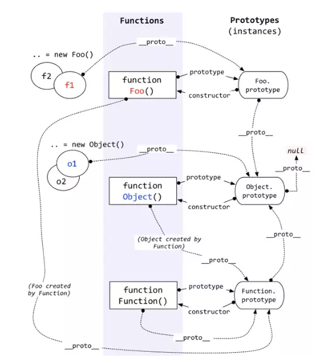

# JavaScript

**🔞 有啥问题最好先滚去看一下文档👉 [MDN JavaScript 文档](https://developer.mozilla.org/zh-CN/docs/Web/JavaScript)**

## 内置数据类型

**JS 中分为七种内置类型，七种内置类型又分为两大类型：基本类型和引用数据类型（Object）。**

**基本类型有六种： null，undefined，boolean，number，string，symbol。**

>
> NaN 也属于 number 类型，并且 NaN 不等于自身。
>
> 还有一个没有正式发布但即将被加入标准的原始类型 BigInt。

对于基本类型来说，如果使用字面量的方式，那么这个变量只是个字面量，只有在必要的时候才会转换为对应的类型。

```javascript
let a = 111 // 这只是字面量，不是 number 类型
a.toString() // 使用时候才会转换为对象类型
```

对象（Object）是引用类型，在使用过程中会遇到浅拷贝和深拷贝的问题。

```javascript
let a = { name: 'FE' }
let b = a
b.name = 'EF'
console.log(a.name) // EF
```

**拓展：null 与 undefined 的区别？[stackoverflow](https://stackoverflow.com/questions/5076944/what-is-the-difference-between-null-and-undefined-in-javascript)**

> **null 表示为空，代表此处不应该有值的存在。**
>
>  一个对象可以是 null，代表是个空对象，而 null 本身也是对象。常用来表示函数企图返回一个不存在的对象。用法：
>
> 1. 作为函数的参数，表示该函数的参数不是对象。
> 2. 作为对象原型链的终点。
>
> **undefined 表示『不存在』。**
>
>  JavaScript 是一门动态类型语言，成员除了表示存在的空值外，还有可能根本就不存在（因为存不存在只有在运行时才知道），这就是 undefined 的意义所在。用法：
>
> 1. 当声明的变量还未被初始化时，变量的默认值为 undefined。
> 2. 调用函数时，应该提供的参数没有提供，该参数等于 undefined。
> 3. 对象没有赋值的属性，该属性的值为 undefined。
> 4. 函数没有返回值时，默认返回 undefined。
> 
> 
> null表示空，指向一个固定的内存地址。undefined 是声明了但是没赋值。

## 数据类型判断

### 1. typeof

::: tip

使用`typeof`能够快速区分出 Null 之外的各种基本数据类型。

:::

```javascript
typeof 1 // 'number'
typeof '1' // 'string'
typeof undefined // 'undefined'
typeof true // 'boolean'
typeof Symbol() // 'symbol' es6 新增
typeof b // b 没有声明，但是还会显示 undefined
```
::: tip

而`typeof` 对于对象，除了函数都会显示 `object`。所以说 `typeof` 并不能准确判断变量到底是什么类型。

:::

```js
typeof [] // 'object'  对于数组的判断，还可以使用 es6 新增的 Array.isArray()
typeof {} // 'object'
typeof console.log // 'function'
```

对于特殊的 `null` 来说，虽然它是基本类型，但是使用`typeof`会显示 `object`，这是一个存在很久了的 Bug。

```js
typeof null // 'object'
```

> PS：为什么会出现这种情况呢？
>
> 因为在 JS 的最初版本中，使用的是 32 位系统，为了性能考虑使用低位存储了变量的类型信息，`000` 开头代表是对象，然而 `null` 表示为全零，所以将它错误的判断为 `object` 。虽然现在的内部类型判断代码已经改变了，但是对于这个 Bug 却是一直流传下来。

### 2. instanceof

::: tip

使用`instanceof` 可以正确的判断对象的类型。

:::

> 因为它的内部机制是通过查找对象的 [原型链](/frontend/JavaScript/#原型)，看是否能找到构造函数的原型对象 `prototype`从而来判断对象类型的。

优点：能够区分 Array、Object 和 Function，适合用于判断自定义的类实例对象 

```js
[] instanceof Array                   // true
function(){} instanceof Function      // true
{} instanceof Object                  // true
```

缺点：Number，Boolean，String 这些基本数据类型不能判断

```js
2 instanceof Number					//false
true instanceof Boolean     //false
'str' instanceof String  		//false
```

**手动实现一下 `instanceof`：**

1. 首先获取类型的原型
2. 然后获得对象的原型
3. 最后一直循环判断对象的原型是否等于类型的原型，直到对象原型为 null，因为原型链最终为 null。

```js{2,4,8}
function instanceof(left, right) {
    let prototype = right.prototype;
    
    left = left.__proto__;
    while (true) {
    	if (left === null)
    		return false
    	if (prototype === left)
    		return true
    	left = left.__proto__
    }
}
```

### 3. Object.prototype.toString.call(xx)

::: tip

如果我们想正确获得一个变量的类型，可以通过 `Object.prototype.toString.call(xx)`。👍

:::

```js
Object.prototype.toString.call(2)    		  //[object Number]
Object.prototype.toString.call(true)			//[object Boolean]                
Object.prototype.toString.call('str') 		//[object String]
Object.prototype.toString.call([])				//[object Array]
Object.prototype.toString.call(() => {})	//[object Function]
Object.prototype.toString.call({})				//[object Object]
Object.prototype.toString.call(undefined) //[object Undefined]
Object.prototype.toString.call(null)			//[object Null]
```

这样我们就可以获得一个类似 `[object Type]` 的字符串，从而可以精准判断数据的类型。但是这种写法繁琐不容易记，推荐进行封装后使用。

## 数据类型转换

由于 JavaScript 是一门动态类型的语言，可以随时给变量赋予任意值，但是各种运算符或条件判断时是需要知道变量的特定类型的，因此 JavaScript 引擎会在运算时为变量设定类型。

这看起来很美好，JavaScript 引擎帮我们搞定了变量类型的问题，但是引擎毕竟不是 ASI（超级人工智能），如果我们不了解这些转换规则，那么它的很多动作往往会跟我们预期相去甚远。

::: tip

首先我们要知道，在  JS 中数据类型转换只有三种情况，分别是：

- 转换为布尔值
- 转换为数字
- 转换为字符串

:::

### (条件判断)转 Boolean

在条件判断时，除了 `undefined`， `null`， `false`， `NaN`， `''`， `0`， `-0`，其他所有值都转为 `true`，包括所有对象。

### 对象转基本类型

对象在转换基本类型时，会调用其内置的 `[[ToPrimitive]]` 函数，对于该函数来说，算法逻辑一般来说如下：

- 如果已经是原始类型了，则不需要转换
- 调用 `x.valueOf()`，如果转换为基础类型，就返回转换的值
- 调用 `x.toString()`，如果转换为基础类型，就返回转换的值
- 如果都没有返回原始类型，就会报错

```js
// 这几个方法都是可以重写的
let a = {
  valueOf() {
    return 0;
  },
  toString() {
    return '1';
  },
  [Symbol.toPrimitive]() {
    return 2;
  }
}
1 + a // => 3
'1' + a // => '12'
```

当然你也可以重写 `Symbol.toPrimitive` ，该方法在转基本类型时调用优先级最高。

### 四则运算符

加法`+`：

1. 运算中其中一方为字符串，那么就会把另一方也转换为字符串类型
2. 如果一方不是字符串或者数字，那么会将它转换为数字或者字符串

```js
1 + '1' // '11' 触发特点1
true + true // 2  触发特点2
4 + [1,2,3] // "41,2,3"  触发特点2（数组通过 toString转为字符串 1,2,3）
```

另外对于加号需要注意这个表达式 `'a' + + 'b'`

```js
'a' + + 'b' // "aNaN"
// 因为 + 'b' -> NaN
// 你也许在一些代码中看到过使用 + '1' -> 1 的形式来快速获取 number 类型。
```

- 其他运算只要其中一方是数字，那么另一方就转为数字。

```js
4 * '3' // 12
4 * [] // 0
4 * [1, 2] // NaN
```

### 比较运算符

1. 如果是对象，就通过 `toPrimitive` 转换对象
2. 如果是字符串，就通过 `unicode` 字符索引来比较

### == 操作符


上图中的 `toPrimitive` 就是对象转基本类型。

这里来解析一道题目 `[] == ![] // -> true` ，下面是这个表达式为何为 `true` 的步骤：

```js
// [] 转成 true，然后取反变成 false
[] == false
// 根据第 8 条得出
[] == ToNumber(false)
[] == 0
// 根据第 10 条得出
ToPrimitive([]) == 0
// [].toString() -> ''
'' == 0
// 根据第 6 条得出
0 == 0 // -> true
```

## 原型与原型链

这个问题重点在于要搞清楚两个关键点：

1. 原型对象是什么？
2. 原型链是如何形成的？

### 原型对象

**绝大部分的函数（少数内建函数除外，Math) 都有一个`prototype`属性，这个属性值是一个对象，即构造函数用来创建新实例的原型。**  而所有被创建的实例对象都会共享原型对象，因此这些对象便可以访问原型对象的属性。

例如`hasOwnProperty()`方法存在于 Obejct 原型对象中，它便可以被任何对象当做自己的方法使用。

> 用法：`object.hasOwnProperty( propertyName )`
>
> 如果对象`object`具有名称为`propertyName`的属性，则返回`true`，否则返回`false`。

```javascript
 var person = {
    name: "Nasrion",
    age: 20,
    gender: "woman"
  };
person.hasOwnProperty("name") //true
person.hasOwnProperty("hasOwnProperty") //false
Object.prototype.hasOwnProperty("hasOwnProperty") //true
```

由以上代码可知，`hasOwnProperty()`并不存在于`person`对象中，但是`person`依然可以拥有此方法。

所以`person`对象是如何找到`Object`对象中的方法的呢？

### 原型链

原因是**每个对象都有 `__proto__` 属性，此属性指向该对象的构造函数的原型。**

> 其实这个属性指向了 `[[prototype]]`，但是 `[[prototype]]` 是内部属性，我们并不能访问到，所以使用 `_proto_` 来访问。
>

对象可以通过 `__proto__`与上游的构造函数的原型对象连接起来，来寻找不属于该对象的属性。而上游的原型对象也有一个`__proto__`，这样就形成了原型链。



如果你想更进一步的了解原型，可以仔细阅读 [深度解析原型中的各个难点](https://github.com/KieSun/Blog/issues/2)。

## this

`this` 的指向问题是很多人都会混淆的概念，但其实它一点都不难。不同的指向只是在于遵循了一定的绑定规则，你只需要记住这几个规则就可以了。

首先，在默认情况下，this 是指向全局对象的，比如在浏览器中就是指向 window。

```js
name = "Mintnoii";

function sayName () {
    console.log(this.Mintnoii);
};

sayName(); //"Mintnoii"
```

其次，如果函数被调用的位置存在上下文对象时，那么函数是被隐式绑定的。

```js
function f() {
    console.log( this.name );
}

var obj = {
    name: "Mintnoii",
    f: f
};

obj.f(); // 被调用的位置恰好被对象 obj 拥有，因此结果是 Mintnoii
```

再次，显式地改变 this 绑定指向，常见的方法就是 call、apply、bind。

```js
// 以 bind 为例：
function f() {
    console.log( this.name );
}
var obj = {
    name: "Mintnoii",
};

var obj1 = {
     name: "Spike"
};

f.bind(obj)(); // Mintnoii , 由于 bind 将 obj 绑定到 f 函数上后返回一个新函数，因此需要再在后面加上括号进行执行，这是 bind 与 apply 和 call 的区别
```

最后，也是优先级最高的 new 绑定。

用 new 调用一个构造函数，会创建一个新对象，在创造这个新对象的过程中，新对象会自动绑定到 Person 对象的 this 上，那么 this 自然就指向这个新对象，不会被任何方式修改。

```js
function Person(name) {
  this.name = name;
  console.log(name);
}

var person1 = new Person('Mintnoii'); // Mintnoii
```
总结起来就两点：

**1. this 的指向不是在编写时确定的，而是在执行时确定的**

**2. this 绑定的优先级：new 绑定 > 显式绑定 >隐式绑定 >默认绑定**

以上几种情况明白了，很多代码中的 `this` 应该就没什么问题了。

那么下面让我们看看箭头函数中的 `this`。

**其实箭头函数并没有属于自己的 this。** 它的所谓的 this 是捕获其所在上下文中的 this 值来作为自己的 this 值。并且由于它没有属于自己的 this，同时箭头函数又是不会被 new 调用的，所以这个所谓的箭头函数的 this 也不会被改变。

我们可以用 Babel 理解一下箭头函数：

```js
// ES6
const obj = {
    getArrow() {
        return () => {
            console.log(this === obj);
        };
    }
} 
```

转化后，所谓的『箭头函数的 this 』其实就是 getArrow 函数上下文中的`_this`。

```js
// ES5，由 Babel 转译
var obj = {
    getArrow: function getArrow() {
        var _this = this;
        return function () {
            console.log(_this === obj);
        };
    }
};
```

## new

我们在调用 `new` 的过程中会发生以下四件事情：

1. 创建成一个新对象
2. 链接到原型
3. 绑定 this
4. 返回新对象

我们也可以试着来自己实现一个 `new`

```js
function create() {
    // 创建一个空的对象
    let obj = new Object()
    // 获得构造函数
    let Con = [].shift.call(arguments)
    // 链接到构造函数的原型
    obj.__proto__ = Con.prototype
    // 执行构造函数，绑定 this
    let result = Con.apply(obj, arguments)
    // 确保 new 出来的是个对象
    return typeof result === 'object' ? result : obj
}
```

对于实例对象来说，都是通过 `new` 产生的，无论是 `function Foo()` 还是 `let a = { b : 1 }` 。

对于创建一个对象来说，更推荐使用字面量的方式创建对象（无论性能上还是可读性）。因为你使用 `new Object()` 的方式创建对象需要通过作用域链一层层找到 `Object`，但是你使用字面量的方式就没这个问题。

```js
function Foo() {}
// function 就是个语法糖
// 内部等同于 new Function()
let a = { b: 1 }
// 这个字面量内部也是使用了 new Object()
```

对于 `new` 来说，还需要注意下运算符优先级。

```js
function Foo() {
    return this;
}
Foo.getName = function () {
    console.log('1');
};
Foo.prototype.getName = function () {
    console.log('2');
};

new Foo.getName();   // -> 1
new Foo().getName(); // -> 2
```


从上图可以看出，`new Foo()` 的优先级大于 `new Foo` ，所以对于上述代码来说可以这样划分执行顺序

```js
new (Foo.getName());
(new Foo()).getName();
```

对于第一个函数来说，先执行了 `Foo.getName()` ，所以结果为 1；对于后者来说，先执行 `new Foo()` 产生了一个实例，然后通过原型链找到了 `Foo` 上的 `getName` 函数，所以结果为 2。

## 闭包

::: tip

[MDN](https://developer.mozilla.org/zh-CN/docs/Web/JavaScript/Closures) 对它的解释：**闭包是函数和声明该函数的词法环境的组合**。

:::

函数 A 返回了一个函数 B，并且函数 B 中使用了函数 A 的变量，函数 B 就被称为闭包。

```js
function A() {
  let a = 1
  function B() {
      console.log(a)
  }
  return B
}
var test = A()
test() // 1
// 或者是 A()()、(A())()
```

::: tip

**闭包存在的意义就是让我们可以间接地访问函数内部的变量。**

:::

为什么函数 A 已经弹出调用栈了，为什么函数 B 还能引用到函数 A 中的变量？

因为闭包的一大特性就是**即使其外部函数被返回（寿命终结），内部函数仍然可以访问其所在的外部函数中声明的参数和变量。**

> 此时函数 A 中的变量此时是存储在(内存)堆上的。
>
> 现在的 JS 引擎可以通过逃逸分析辨别出哪些变量需要存储在堆上，哪些需要存储在栈上。

**优点：** 隐藏变量，避免外界或全局变量的污染；方便设计私有方法和变量、特权变量、储存变量，从而实现封装和缓存等。

**缺点：** 闭包会常驻内存，会增大内存使用量，使用不当很容易造成内存泄露。

> - 在浏览器端可以通过强制刷新解决，对用户体验影响不大
>- 在服务端，由于 node 的内存限制和累积效应，可能会造成进程退出甚至服务器沓机

经典面试题，循环中使用闭包解决 `var` 定义函数的问题

```js
for ( var i=1; i<=5; i++) {
	setTimeout( function timer() {
		console.log( i );
	}, i*1000 );
}
```

首先因为 `setTimeout` 是个异步函数，所有会先把循环全部执行完毕，这时候 `i` 就是 6 了，所以会输出一堆 6。

如果不使用 `let` 定义 `i` ，那么一般有两种解决办法。

第一种使用闭包：

```js
for (var i = 1; i <= 5; i++) {
  (function(j) {
    setTimeout(function timer() {
      console.log(j);
    }, j * 1000);
  })(i);
}
```

第二种就是使用 `setTimeout` 的第三个参数：

```js
for ( var i=1; i<=5; i++) {
	setTimeout( function timer(j) {
		console.log( j );
	}, i*1000, i);
}
```

## 深浅拷贝

如果将一个对象变量赋值给另一个变量，那么两者的值会是同一个引用，其中一方改变，另一方也会相应改变。

```js
let a = {
    age: 1
}
let b = a
a.age = 2
console.log(b.age) // 2
```

通常在开发中我们不希望出现这样的问题，此时可以使用浅拷贝来解决这个问题。

### 浅拷贝

第一种方法： `Object.assign` 

```js
let a = {
    age: 1
}
let b = Object.assign({}, a)
a.age = 2
console.log(b.age) // 1
```

第二种方法：展开运算符（…）

```js
let a = {
    age: 1
}
let b = {...a}
a.age = 2
console.log(b.age) // 1
```

通常浅拷贝在大部分场景下都解决问题，但是当我们遇到如下情况：

```js
let a = {
    age: 1,
    jobs: {
        first: 'FE'
    }
}
let b = {...a}
a.jobs.first = 'native'
console.log(b.jobs.first) // native
```

浅拷贝只解决了第一层的问题，如果原对象的值中还有对象的话，那么就又回到最初的问题了，复制后的两个变量享有相同的引用。

要解决这个问题，我们就需要使用深拷贝遍历对象中的每一个属性。

### 深拷贝

深拷贝最常用的方法是： `JSON.parse(JSON.stringify(object))` 

```js
let a = {
    age: 1,
    jobs: {
        first: 'FE'
    }
}
let b = JSON.parse(JSON.stringify(a))
a.jobs.first = 'native'
console.log(b.jobs.first) // FE
```

但是该方法也是有局限性的：

- 会抛弃对象的`constructor`，所有的构造函数会指向`Object`
- 会忽略 `undefined`、 `symbol`
- 不能序列化函数、`RegExp`等特殊对象
- 不能解决循环引用的对象，会报错

```js
let obj = {
  a: 1,
  b: {
    c: 2,
    d: 3,
  },
}
obj.c = obj.b
obj.e = obj.a
obj.b.c = obj.c
obj.b.d = obj.b
obj.b.e = obj.b.c
let newObj = JSON.parse(JSON.stringify(obj))
console.log(newObj)
```

如果你有这么一个循环引用对象，你会发现你不能通过该方法深拷贝


在遇到 `函数`、 `undefined` 或者 `symbol` 的时候，该对象也不能正常的序列化，它们会被忽略掉。

```js
let a = {
    age: undefined,
    sex: Symbol('male'),
    jobs: function() {},
    name: 'mintnoii',
    reg: new RegExp("e","g")
}
let b = JSON.parse(JSON.stringify(a))

console.log(b) // {name: "mintnoii", reg: {}}
```

但是在通常情况下，复杂数据都是可以序列化的，所以这个函数可以解决大部分问题，并且该函数是内置函数中处理深拷贝性能最快的。

> 当然如果你的数据中含有以上三种情况，可以使用 [lodash 的深拷贝函数](https://lodash.com/docs##cloneDeep)。

### 共享传值

JavaScript 中函数参数的传递方式是按值传递（传内存拷贝）的，准确来说是按共享传值（传引用的拷贝 call-by-sharing）。

> [Is JavaScript a pass-by-reference or pass-by-value language?](https://stackoverflow.com/questions/518000/is-javascript-a-pass-by-reference-or-pass-by-value-language)

## 防抖与节流

### 防抖

你是否在日常开发中遇到一个问题，在滚动事件中需要做个复杂计算或者实现一个按钮的防二次点击操作。

这些需求都可以通过函数防抖动来实现。尤其是第一个需求，如果在频繁的事件回调中做复杂计算，很有可能导致页面卡顿，不如将多次计算合并为一次计算，只在一个精确点做操作。

PS：防抖和节流的作用都是防止函数多次调用。区别在于，假设一个用户一直触发这个函数，且每次触发函数的间隔小于 wait，防抖的情况下只会调用一次，而节流的 情况会每隔一定时间（参数 wait）调用函数。

我们先来看一个袖珍版的防抖理解一下防抖的实现：

```js
// func 是用户传入需要防抖的函数
// wait 是等待时间
const debounce = (func, wait = 50) => {
  // 缓存一个定时器 id
  let timer = 0
  // 这里返回的函数是每次用户实际调用的防抖函数
  // 如果已经设定过定时器了就清空上一次的定时器
  // 开始一个新的定时器，延迟执行用户传入的方法
  return function(...args) {
    if (timer) clearTimeout(timer)
    timer = setTimeout(() => {
      func.apply(this, args)
    }, wait)
  }
}
// 不难看出如果用户调用该函数的间隔小于 wait 的情况下，上一次的时间还未到就被清除了，并不会执行函数
```

这是一个简单版的防抖，但是有缺陷，这个防抖只能在最后调用。一般的防抖会有 immediate 选项，表示是否立即调用。这两者的区别，举个栗子来说：

- 例如在搜索引擎搜索问题的时候，我们当然是希望用户输入完最后一个字才调用查询接口，这个时候适用`延迟执行`的防抖函数，它总是在一连串（间隔小于 wait 的）函数触发之后调用。
- 例如用户给 interviewMap 点 star 的时候，我们希望用户点第一下的时候就去调用接口，并且成功之后改变 star 按钮的样子，用户就可以立马得到反馈是否 star 成功了，这个情况适用`立即执行`的防抖函数，它总是在第一次调用，并且下一次调用必须与前一次调用的时间间隔大于 wait 才会触发。

下面我们来实现一个带有立即执行选项的防抖函数

```js
// 这个是用来获取当前时间戳的
function now() {
  return +new Date()
}
/**
 * 防抖函数，返回函数连续调用时，空闲时间必须大于或等于 wait，func 才会执行
 *
 * @param  {function} func        回调函数
 * @param  {number}   wait        表示时间窗口的间隔
 * @param  {boolean}  immediate   设置为 ture 时，是否立即调用函数
 * @return {function}             返回客户调用函数
 */
function debounce (func, wait = 50, immediate = true) {
  let timer, context, args

  // 延迟执行函数
  const later = () => setTimeout(() => {
    // 延迟函数执行完毕，清空缓存的定时器序号
    timer = null
    // 延迟执行的情况下，函数会在延迟函数中执行
    // 使用到之前缓存的参数和上下文
    if (!immediate) {
      func.apply(context, args)
      context = args = null
    }
  }, wait)

  // 这里返回的函数是每次实际调用的函数
  return function(...params) {
    // 如果没有创建延迟执行函数（later），就创建一个
    if (!timer) {
      timer = later()
      // 如果是立即执行，调用函数
      // 否则缓存参数和调用上下文
      if (immediate) {
        func.apply(this, params)
      } else {
        context = this
        args = params
      }
    // 如果已有延迟执行函数（later），调用的时候清除原来的并重新设定一个
    // 这样做延迟函数会重新计时
    } else {
      clearTimeout(timer)
      timer = later()
    }
  }
}
```

整体函数实现的不难，总结一下。

- 对于按钮防点击来说的实现：如果函数是立即执行的，就立即调用，如果函数是延迟执行的，就缓存上下文和参数，放到延迟函数中去执行。一旦我开始一个定时器，只要我定时器还在，你每次点击我都重新计时。一旦你点累了，定时器时间到，定时器重置为 `null`，就可以再次点击了。
- 对于延时执行函数来说的实现：清除定时器 ID，如果是延迟调用就调用函数

### 节流

防抖动和节流本质是不一样的。防抖动是将多次执行变为最后一次执行，节流是将多次执行变成每隔一段时间执行。

```js
/**
 * underscore 节流函数，返回函数连续调用时，func 执行频率限定为 次 / wait
 *
 * @param  {function}   func      回调函数
 * @param  {number}     wait      表示时间窗口的间隔
 * @param  {object}     options   如果想忽略开始函数的的调用，传入{leading: false}。
 *                                如果想忽略结尾函数的调用，传入{trailing: false}
 *                                两者不能共存，否则函数不能执行
 * @return {function}             返回客户调用函数
 */
_.throttle = function(func, wait, options) {
    var context, args, result;
    var timeout = null;
    // 之前的时间戳
    var previous = 0;
    // 如果 options 没传则设为空对象
    if (!options) options = {};
    // 定时器回调函数
    var later = function() {
      // 如果设置了 leading，就将 previous 设为 0
      // 用于下面函数的第一个 if 判断
      previous = options.leading === false ? 0 : _.now();
      // 置空一是为了防止内存泄漏，二是为了下面的定时器判断
      timeout = null;
      result = func.apply(context, args);
      if (!timeout) context = args = null;
    };
    return function() {
      // 获得当前时间戳
      var now = _.now();
      // 首次进入前者肯定为 true
	  // 如果需要第一次不执行函数
	  // 就将上次时间戳设为当前的
      // 这样在接下来计算 remaining 的值时会大于 0
      if (!previous && options.leading === false) previous = now;
      // 计算剩余时间
      var remaining = wait - (now - previous);
      context = this;
      args = arguments;
      // 如果当前调用已经大于上次调用时间 + wait
      // 或者用户手动调了时间
 	  // 如果设置了 trailing，只会进入这个条件
	  // 如果没有设置 leading，那么第一次会进入这个条件
	  // 还有一点，你可能会觉得开启了定时器那么应该不会进入这个 if 条件了
	  // 其实还是会进入的，因为定时器的延时
	  // 并不是准确的时间，很可能你设置了 2 秒
	  // 但是他需要 2.2 秒才触发，这时候就会进入这个条件
      if (remaining <= 0 || remaining > wait) {
        // 如果存在定时器就清理掉否则会调用二次回调
        if (timeout) {
          clearTimeout(timeout);
          timeout = null;
        }
        previous = now;
        result = func.apply(context, args);
        if (!timeout) context = args = null;
      } else if (!timeout && options.trailing !== false) {
        // 判断是否设置了定时器和 trailing
	    // 没有的话就开启一个定时器
        // 并且不能不能同时设置 leading 和 trailing
        timeout = setTimeout(later, remaining);
      }
      return result;
    };
  };
```

## 继承

在 ES5 中，我们可以使用如下方式解决继承的问题

```js
function Super() {}
Super.prototype.getNumber = function() {
  return 1
}

function Sub() {}
let s = new Sub()
Sub.prototype = Object.create(Super.prototype, {
  constructor: {
    value: Sub,
    enumerable: false,
    writable: true,
    configurable: true
  }
})
```

以上继承实现思路就是将子类的原型设置为父类的原型

在 ES6 中，我们可以通过 `class` 语法轻松解决这个问题

```js
class MyDate extends Date {
  test() {
    return this.getTime()
  }
}
let myDate = new MyDate()
myDate.test()
```

但是 ES6 不是所有浏览器都兼容，所以我们需要使用 Babel 来编译这段代码。

如果你使用编译过得代码调用 `myDate.test()` 你会惊奇地发现出现了报错

`Uncaught TypeError: this is not a Date object`

因为在 JS 底层有限制，如果不是由 `Date` 构造出来的实例的话，是不能调用 `Date` 里的函数的。所以这也侧面的说明了：**ES6 中的 class 继承与 ES5 中的一般继承写法是不同的**。

既然底层限制了实例必须由 `Date` 构造出来，那么我们可以改变下思路实现继承

```js
function MyData() {

}
MyData.prototype.test = function () {
  return this.getTime()
}
let d = new Date()
Object.setPrototypeOf(d, MyData.prototype)
Object.setPrototypeOf(MyData.prototype, Date.prototype)
```

以上继承实现思路：**先创建父类实例** => 改变实例原先的 `_proto__` 转而连接到子类的 `prototype` => 子类的 `prototype` 的 `__proto__` 改为父类的 `prototype`。

通过以上方法实现的继承就可以完美解决 JS 底层的这个限制。

## call、apply、bind

首先说下前两者的区别：

::: tip

- `call` 和 `apply` 都是为了解决改变 `this` 的指向。作用都是相同的，只是传参的方式不同。
- 除了第一个参数外，`call` 可以接收一个参数列表，`apply` 只接受一个参数数组。

:::

```js
let a = {
    value: 1
}
function getValue(name, age) {
    console.log(name,age)
    console.log(this.value)
}
getValue.call(a, 'mintnoii', '22')
getValue.apply(a, ['mintnoii', '22'])
```

### 手动实现 call 和 apply

可以从以下几点来考虑如何实现：

- 不传入第一个参数，那么上下文默认为 `window`。
- 改变了`this`指向，让新的对象可以执行该函数，并能接受参数。
- 那么思路可以变成给新的对象添加一个函数，然后在执行完以后删除。

```js
Function.prototype.myCall = function (context) {
  // 如有必要，要确保调用myCall改变this指向的是一个方法。
  if (typeof this !== 'function') {
    throw new TypeError('Error');
  }
  
  // 首先 context 为可选参数，如果不传的话默认上下文为 window
  context = context || window;
  
  // 接下来给 context 添加一个 fn 属性，并将值设置为需要调用的函数（这里的 this 就是要调用这个 myCall 的方法）
  context.fn = this;
  // 目标效果: getValue.myCall(a, 'mintnoii', '22') => a.fn = getValue

  // 因为 call 可以传入多个参数作为调用函数的参数，所以需要将 context 后面的参数剥离出来
  const args = [...arguments].slice(1);
  // 目标效果: getValue.myCall(a, 'mintnoii', '22') => a.fn('mintnoii', '22')

  // 然后利用新创建的对象执行该函数
  const result = context.fn(...args);

  // 最后将对象上的函数删除
  delete context.fn;
  return result;
}
```

::: tip

以上就是 `call` 的实现思路与流程，`apply` 的实现也类似，区别就在于对参数的处理。

:::

```js
Function.prototype.myApply = function (context) {
  if (typeof this !== 'function') {
    throw new TypeError('Error');
  }
  context = context || window;
  context.fn = this;
  
  let result;
  // 处理参数和 call 有区别
  
  // 如果存在第二个参数数组，就将其展开后传递给 fn 并执行该函数
  if (arguments[1]) {
    result = context.fn(...arguments[1]);
  } else {
    result = context.fn();
  }
  
  delete context.fn;
  return result;
}
```

::: tip

**`bind` 和其他两个方法的作用是一样的，只是该方法会返回一个函数。并且我们可以通过 `bind` 实现柯里化。**

:::

::: tip

`bind` 的实现对比 call、apply 略微地复杂了一点，因为 `bind` 要返回一个函数，需要判断一些边界问题。

:::

- `bind` 返回了一个函数，对于函数来说有两种方式调用，一种是直接调用，一种是通过 `new` 的方式，我们先来说直接调用的方式
- 对于直接调用来说，这里选择了 `apply` 的方式实现，但是对于参数需要注意以下情况：因为 `bind` 可以实现类似这样的代码 `f.bind(obj, 1)(2)`，所以我们需要将两边的参数拼接起来，于是就有了这样的实现 `args.concat(...arguments)`
- 最后来说通过 `new` 的方式，在上面的👆 `this`部分，我们已经知道，对于 `new` 的情况来说，`this`不会被任何方式改变，所以对于这种情况我们需要忽略传入的 `this`。

```js
Function.prototype.myBind = function (context) {
  if (typeof this !== 'function') {
    throw new TypeError('Error');
  }
  const _this = this;
  const args = [...arguments].slice(1);
  // 返回一个函数
  return function F() {
    // 因为返回了一个函数，我们可以 new F()，所以需要判断
    if (this instanceof F) {
      return new _this(...args, ...arguments);
    }
    return _this.apply(context, args.concat(...arguments));
  }
}
```
> 更多实现方式与细节问题查看 [MDN 比较权威的实现](https://developer.mozilla.org/zh-CN/docs/Web/JavaScript/Reference/Global_Objects/Function/apply)
>
> 推荐阅读：[JavaScript深入之bind的模拟实现](https://github.com/mqyqingfeng/Blog/issues/12)

## async 和 await
async 和 await，就是 Generator 函数的语法糖，它建立在 Promises 上，并且与所有现有的基于 Promise 的 API 兼容。

**async**

1. Async—声明一个异步函数 (async function someName(){...})
2. 自动将常规函数转换成 Promise，返回值也是一个 Promise 对象
3. 只有 async 函数内部的异步操作执行完，才会执行 then 方法指定的回调函数
4. 异步函数内部可以使用 await

```js
async function test() {
  return "1";
}
console.log(test()); // -> Promise {<resolved>: "1"}
```

一个函数如果加上 `async` ，那么该函数就会返回一个 `Promise`，可以把 `async` 看成将函数返回值使用 `Promise.resolve()` 包裹了下。

**await**

1. Await—暂停异步的功能执行 (var result = await someAsyncCall()
2. 放置在 Promise 调用之前，await 强制其他代码等待，直到 Promise 完成并返回结果
3. 只能与 Promise 一起使用，不适用与回调
4. 只能在 async 函数内部使用

```js
function sleep() {
  return new Promise(resolve => {
    setTimeout(() => {
      console.log('finish')
      resolve("sleep");
    }, 2000);
  });
}
async function test() {
  let value = await sleep();
  console.log("object");
}
test()
```

上面代码会先打印 `finish` 然后再打印 `object` 。因为 `await` 会等待 `sleep` 函数 `resolve` ，所以即使后面是同步代码，也不会先去执行同步代码再来执行异步代码。

下面来看一个使用 `await` 的代码。

```js
var a = 0
var b = async () => {
  a = a + await 10
  console.log('2', a) // -> '2' 10
  a = (await 10) + a
  console.log('3', a) // -> '3' 20
}
b()
a++
console.log('1', a) // -> '1' 1
```

对于以上代码你可能会有疑惑，这里说明下原理

- 首先函数 `b` 先执行，在执行到 `await 10` 之前变量 `a` 还是 0，因为在 `await` 内部实现了 `generators` ，`generators` 会保留堆栈中东西，所以这时候 `a = 0` 被保存了下来
- 因为 `await` 是异步操作，遇到`await`就会立即返回一个`pending`状态的`Promise`对象，暂时返回执行代码的控制权，使得`async`函数外的代码得以继续执行，所以会先执行 `console.log('1', a)`
- 这时候同步代码执行完毕，开始执行异步代码，将保存下来的值拿出来使用，这时候 `a = 10`
- 然后后面就是常规执行代码了

**async/await 相比于 Promise 的优势与缺点？**

优点：
1. 代码可读性更强。Promise 虽然摆脱了回调地狱，但是`then`的链式调用也会带来额外的阅读负担
2. Promise 传递中间值非常麻烦，而 async/await 几乎是同步的写法，写法非常优雅
3. 错误处理友好，async/await 可以用成熟的 try/catch，Promise 的错误捕获非常冗余
4. 调试友好，Promise 的调试很差，由于没有代码块，你不能在一个返回表达式的箭头函数中设置断点，如果你在一个`.then`代码块中使用调试器的步进 (step-over) 功能，调试器并不会进入后续的`.then`代码块，因为调试器只能跟踪同步代码的『每一步』。

缺点：
- 滥用 `await` 可能会导致性能问题，因为 `await` 会阻塞代码，也许之后的异步代码并不依赖于前者，但仍然需要等待前者完成，导致代码失去了并发性。

## Proxy

Proxy 是 ES6 中新增的功能，可以用来自定义对象中的操作

```js
let p = new Proxy(target, handler);
// `target` 代表需要添加代理的对象
// `handler` 用来自定义对象中的操作
```

可以很方便的使用 Proxy 来实现一个数据绑定和监听

```js
let onWatch = (obj, setBind, getLogger) => {
  let handler = {
    get(target, property, receiver) {
      getLogger(target, property)
      return Reflect.get(target, property, receiver);
    },
    set(target, property, value, receiver) {
      setBind(value);
      return Reflect.set(target, property, value);
    }
  };
  return new Proxy(obj, handler);
};

let obj = { a: 1 }
let value
let p = onWatch(obj, (v) => {
  value = v
}, (target, property) => {
  console.log(`Get '${property}' = ${target[property]}`);
})
p.a = 2 // bind `value` to `2`
p.a // -> Get 'a' = 2
```

## 为什么 0.1 + 0.2 != 0.3

因为 JS 的数字类型是浮点类型的，没有整型。 而浮点类型是基于 IEEE 754 双精度版本（64 位）标准实现的，只要采用 IEEE 754 的语言都有该问题。

我们都知道计算机表示十进制是采用二进制表示的，所以 `0.1` 在二进制表示为

```js
// (0011) 表示循环
0.1 = 2^-4 * 1.10011(0011)
```

下面说一下原生解决办法，如下代码所示

```js
parseFloat((0.1 + 0.2).toFixed(10))
```

## 正则表达式

### 元字符

| 元字符 |                             作用                             |
| :----: | :----------------------------------------------------------: |
|   .    |                匹配任意字符除了换行符和回车符                |
|   []   |  匹配方括号内的任意字符。比如 [0-9] 就可以用来匹配任意数字   |
|   ^    | ^9，这样使用代表匹配以 9 开头。[`^`9]，这样使用代表不匹配方括号内除了 9 的字符 |
| {1, 2} |                      匹配 1 到 2 位字符                      |
| (yck)  |                   只匹配和 yck 相同字符串                    |
|   \|   |                     匹配 \| 前后任意字符                     |
|   \    |                             转义                             |
|   *    |               只匹配出现 0 次及以上 * 前的字符               |
|   +    |               只匹配出现 1 次及以上 + 前的字符               |
|   ?    |                        ? 之前字符可选                        |

### 修饰语

| 修饰语 |    作用    |
| :----: | :--------: |
|   i    | 忽略大小写 |
|   g    |  全局搜索  |
|   m    |    多行    |

### 字符简写

| 简写 |         作用         |
| :--: | :------------------: |
|  \w  | 匹配字母数字或下划线 |
|  \W  |      和上面相反      |
|  \s  |   匹配任意的空白符   |
|  \S  |      和上面相反      |
|  \d  |       匹配数字       |
|  \D  |      和上面相反      |
|  \b  | 匹配单词的开始或结束 |
|  \B  |      和上面相反      |


