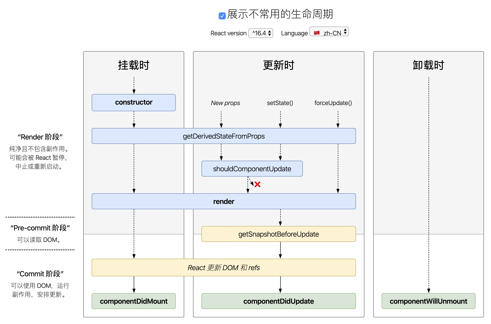
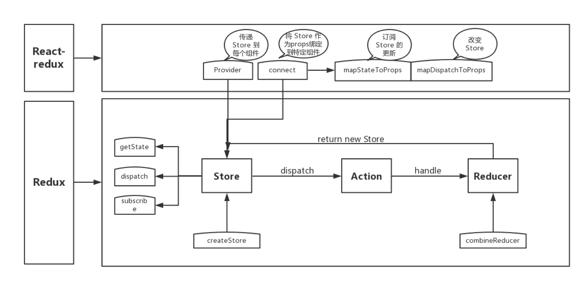

# React

[React 文档学习笔记](https://juejin.im/post/5d372c53e51d4555fc1acd68)

[React 技术揭秘](https://react.iamkasong.com/) 🌟


## 最新的生命周期

[查看 React 生命周期图](http://projects.wojtekmaj.pl/react-lifecycle-methods-diagram/) React 16 之后有三个生命周期将被废弃（但并未删除）

- componentWillMount
- componentWillReceiveProps
- componentWillUpdate

> 官方计划在 17 版本完全删除这三个函数，只保留 UNSAVE_前缀的三个函数，目的是为了向下兼容，但是对于开发者而言应该尽量避免使用它们，而是使用新增的生命周期函数替代它们。



目前 React 16.8 +的生命周期分为三个阶段，分别是挂载阶段、更新阶段、卸载阶段

**挂载阶段：**

- `constructor` 构造函数，最先被执行，我们通常在构造函数里初始化 state 对象或者给自定义方法绑定 this。
- `getDerivedStateFromProps` 当我们接收到新的属性，想去修改我们 state 时，可以使用这个静态方法 static getDerivedStateFromProps(nextProps, prevState)。
- `render` render 函数是纯函数，只返回需要渲染的东西，不应该包含其它的业务逻辑。可以返回原生的 DOM、React 组件、Fragment、Portals、字符串和数字、Boolean 和 null 等内容。
- `componentDidMount` 组件装载之后调用，此时我们可以获取到 DOM 节点并操作，比如对 canvas，svg 的操作，服务器请求，订阅都可以写在这个里面，但是记得要在 componentWillUnmount 中取消订阅。

**更新阶段：**

- getDerivedStateFromProps: 此方法在更新跟挂载阶段都可能会调用。

- `shouldComponentUpdate`  这个方法有两个参数(nextProps, nextState)，表示新的属性和变化之后的 state，返回一个布尔值，默认返回 true 表示会触发重新渲染，false 则不会触发。

  > **我们通常利用此生命周期来优化 React 程序性能**。因为这个方法允许我们手动地判断是否要进行组件更新，根据组件的应用场景设置函数的合理返回值能够帮我们避免不必要的更新和渲染。

- render: 更新阶段也会触发此生命周期。

- `getSnapshotBeforeUpdate` 这个方法在 render 之后，componentDidUpdate 之前调用。也有两个参数(prevProps, prevState)，表示之前的属性和之前的 state，这个函数有一个返回值，会作为第三个参数传给 componentDidUpdate，如果你不想要返回值，可以返回 null，此生命周期必须与 componentDidUpdate 搭配使用。

- `componentDidUpdate` 该方法在 getSnapshotBeforeUpdate 方法之后被调用，有三个参数(prevProps, prevState, snapshot)，分别表示之前的 props，之前的 state，和 snapshot。第三个参数是 getSnapshotBeforeUpdate 返回的，如果触发某些回调函数时需要用到 DOM 元素的状态，则将对比或计算的过程迁移至 getSnapshotBeforeUpdate，然后在 componentDidUpdate 中统一触发回调或更新状态。

**卸载阶段：**

- `componentWillUnmount` 当组件被卸载或者销毁时就会调用，可以在这个函数里去做清除定时器，取消网络请求，清理无效的 DOM 元素等垃圾清理工作。

## 如何理解 Fiber 及 Time Slice 的？

**React Fiber 是一种基于浏览器的单线程调度算法：**

React 16 之前 ，`reconcilation` 算法实际上是递归，想要中断递归是很困难的。如果你拥有一个很复杂的复合组件，然后改动了最上层组件的 `state`，那么调用栈可能会很长。调用栈过长，再加上中间进行了复杂的操作，就可能导致长时间阻塞主线程，带来不好的用户体验。

在 React V16 版本中引入了 Fiber 机制使用循环来代替之前的递归算法来解决这个问题。这个机制在一定程度上的影响了部分生命周期的调用，并且也引入了新的 2 个 API 来解决问题。

**`Fiber`：一种将 `recocilation` （递归 diff），拆分成无数个小任务的算法；它随时能够停止，恢复。停止恢复的时机取决于当前的一帧（16ms）内，还有没有足够的时间允许计算。**

**Time Slice 时间分片：** 


Fiber 本质上是一个虚拟的堆栈帧，新的调度器会按照优先级自由调度这些帧，从而将之前的同步渲染改成了异步渲染，在不影响体验的情况下去分段计算更新。时间分片正是基于可随时打断、重启的 Fiber 架构，可打断当前任务，优先处理紧急且重要的任务，保证页面的流畅运行。

> 对于如何区别优先级，React 有自己的一套逻辑。
>
> 1. 对于动画这种实时性很高的东西，也就是 16 ms 必须渲染一次保证不卡顿的情况下，React 会每 16 ms（以内） 暂停一下更新，返回来继续渲染动画
> 2. 根据事件类型来。打个比方，点击事件、用户输入事件，相比滚动事件的优先级要高 。目前 React 内部事件机制有简单区分优先级
> 3. 人工提示 React。参考实验版本里面的 useTransition，useDeferredValue  
> 4. 隐藏内容的更新优先级最低。这通常也需要提示 React 指定组件是隐藏的，目前没有公开 API

> 推荐阅读：[这可能是最通俗的 React Fiber（时间分片） 打开方式](https://juejin.im/post/5dadc6045188255a270a0f85) 

## Ajax 请求应该放在哪个生命周期中？

::: tip

推荐将异步请求放在 componentDidmount 函数中进行。

:::

如果有特殊需求需要提前请求，也可以在 constructor 中进行。

有人认为在 componentWillMount 中发起 Ajax 请求可以提前异步获取数据，达到避免页面白屏的效果。但其实这个观点是有问题的。

首先：因为 JavaScript 中异步事件的性质，当进行 API 调用时，浏览器会在此期间返回去执行其他工作。所以当 React 渲染一个组件时，它不会等待 componentWillMount 中的任何东西，而是继续进行 render。即：不会“暂停”渲染以等待数据到达。

其次：**在 componentWillMount 中发起请求会有一系列潜在的问题：**

1. 在 SSR 服务器渲染时，如果在 componentWillMount 里获取数据，fetch data 会执行两次，一次在服务端一次在客户端，这造成了多余的请求。
2. 在 React 16 进行 React Fiber 重写后，会通过开始或停止渲染的方式优化应用性能。componentWillMount 这个生命周期函数的调用次数会变得不确定。那么将 Ajax 请求放在这里自然也就不是好的选择。

## setState 到底是异步还是同步？

`setState` 在 React 中是经常使用的一个 API，但是它存在一些问题，可能会导致犯错，核心原因就是因为这个 API **有时表现出异步，有时表现出同步**。

1. setState 只在合成事件和钩子函数中是“异步”的，在原生事件和 setTimeout 中都是同步的。
2. setState 的“异步”并不是说内部由异步代码实现，其实本身执行的过程和代码都是同步的，只是合成事件和钩子函数的调用顺序在更新之前，导致在合成事件和钩子函数中没法立马拿到更新后的值，形成了所谓的“异步”，当然可以通过第二个参数 setState(partialState, callback) 中的 callback 拿到更新后的结果。
  ```js
    handle() {
      this.setState((prevState) => ({ count: prevState.count + 1 }), () => {
          console.log(this.state)
      })
    }
  ```
3. setState 的批量更新优化也是建立在“异步”（合成事件、钩子函数）之上的，在原生事件和 setTimeout 中不会批量更新，在“异步”中如果对同一个值进行多次 setState，setState 的批量更新策略会对其进行覆盖，取最后一次的执行，如果是同时 setState 多个不同的值，在更新时会对其进行合并批量更新。

```js
handle() {
  // 初始化 `count` 为 0
  console.log(this.state.count) // -> 0
  this.setState({ count: this.state.count + 1 })
  console.log(this.state.count) // -> 0
}
```
> - 两次的打印都为 0，因为 `setState` 是个 "异步 API"，只有同步代码运行完毕才会执行。`setState` 异步的原因我认为在于，`setState` 可能会导致 DOM 的重绘，如果调用一次就马上去进行重绘，那么调用多次就会造成不必要的性能损失。设计成异步的话，就可以将多次调用放入一个队列中，在恰当的时候统一进行更新过程。
> - 虽然调用了三次 `setState` ，但是最终 `count` 的值还是为 1。因为多次调用会合并为一次，只有当更新结束后 `state` 才会改变，三次调用等同于如下代码
> ```js
>     Object.assign(
>       {},
>       { count: this.state.count + 1 },
>       { count: this.state.count + 1 }
>     )
> ```

## React 中 keys 的作用是什么？

::: tip

Keys 是 React 用于追踪列表中哪些元素被修改、被添加或者被移除的辅助标识。

:::

> 通常我们输出节点的时候都是 map 一个数组然后返回一个`ReactNode`，为了方便React内部进行优化，我们必须给每一个`reactNode`添加`key`，这个`key prop`在设计之初不是给开发者用的，而是给react用的。
>
> 大概的作用就是给每一个`reactNode`添加一个身份标识，方便React进行识别，在重渲染过程中，如果`key`一样，若组件属性有所变化，则 React只更新组件对应的属性，没有变化则不更新。
>
> 而在react 的渲染过程中，兄弟节点之间，也就是`key`值不一样的时候，则react会先销毁该组件，然后重新创建该组件。

在 `React Diff` 算法中会借助元素的 `Key` 值来判断该元素是新近创建的还是被移动而来的元素，从而减少不必要的渲染，提升性能。所以在开发过程中，**我们需要保证某个元素的 `key` 在其同级元素中具有唯一性**。

> key 要用唯一值，所以不能在数组map的时候用 index，如果在最前面增加一项，之前渲染的项对应的 index 都变了，这样其实就跟没设置key一样了。

此外，React 还需要借助 `Key` 值来判断元素与本地状态的关联关系，因此我们绝不可忽视转换函数中 `Key` 的重要性。

## React 中的事件处理机制？

::: tip

React 自己实现了一套合成事件机制，带来了跨浏览器开发与性能优化的好处。

:::

首先我们思考一下以下代码：

```js
const Test = ({ list, handleClick }) => ({
    list.map((item, index) => (
        <span onClick={handleClick} key={index}>{index}</span>
    ))
})
```

以上类似的代码想必大家经常会写，但是你是否考虑过点击事件是绑定在了每一个标签上的吗？

事实当然不是，JSX 上写的事件并没有绑定在对应的真实 DOM 上，而是通过事件代理的方式，将所有的事件都统一绑定在了 `document` 上。这样的方式不仅减少了内存消耗，还能在组件挂载销毁时统一订阅和移除事件。

> 对于原生浏览器事件来说，浏览器会给监听器创建一个事件对象。如果你有很多的事件监听，那么就需要分配很多的事件对象，造成高额的内存分配问题。但是对于合成事件来说，有一个事件池专门来管理它们的创建和销毁，当事件需要被使用时，就会从池子中复用对象，事件回调结束后，就会销毁事件对象上的属性，从而便于下次复用事件对象。

另外，冒泡到 `document` 上的事件也不是原生浏览器事件（Browser Native Event），而是React自己实现的合成事件（SyntheticEvent）。因此我们如果不想要事件冒泡的话，调用 `event.stopPropagation` 是无效的，而应该调用 `event.preventDefault`

**那么实现合成事件的目的是什么呢？总的来说好处有两点，分别是：**

1. 合成事件提供了与原生事件相同的接口，保证了行为的一致性。同时它抹平了底层浏览器的细节差异，解决了跨浏览器的兼容性问题。另外，这是一个跨浏览器的原生事件包装器，赋予了跨浏览器开发的能力  。
2. 有意思的是，React 并没有直接将事件附着到子元素上，而是以单一事件监听器的方式将所有的事件发送到顶层进行处理。这样 React 在更新 DOM 的时候就不需要考虑如何去处理附着在 DOM 上的事件监听器，最终达到优化性能的目的。

## 使用 React 时有什么坑？

**1. JSX做表达式判断时候，需要强转为boolean类型。**

**2. 尽量不要在 componentWillReviceProps 里使用 setState，如果一定要使用，那么需要判断结束条件，不然会出现无限重渲染，导致页面崩溃。**

**3. 给组件添加ref时候，尽量不要使用匿名函数，因为当组件更新的时候，匿名函数会被当做新的prop处理，让ref属性接受到新函数的时候，react内部会先清空ref，也就是会以null为回调参数先执行一次ref这个props，然后在以该组件的实例执行一次ref，所以用匿名函数做ref的时候，有的时候去ref赋值后的属性会取到null。**

## React 组件通信如何实现？

- 父组件向子组件通讯：父组件可以向通过传递 props 的方式向子组件进行通讯
- 子组件向父组件通讯：props+回调的方式，父组件向子组件传递的 props 中有作用域为父组件自身的函数方法，然后子组件调用该函数，将子组件想要传递的信息，作为参数，传递到父组件的作用域中
- 兄弟组件通信：找到这两个兄弟节点共同的父节点，结合上面两种方式由父节点转发信息进行通信
- 跨层级通信：Context 设计目的是为了共享那些对于一个组件树而言是“全局”的数据，例如当前认证的用户、主题或首选语言，对于跨越多层的全局数据通过 Context 通信再适合不过
- 发布订阅模式：发布者发布事件，订阅者监听事件并做出反应，我们可以通过引入 event 模块进行通信
- 全局状态管理工具：借助 Redux 或者 Mobx 等全局状态管理工具进行通信，这种工具会维护一个全局状态中心 Store, 并根据不同的事件产生新的状态


## Redux 的工作流程？

**核心概念：**

- Store：保存数据的地方，你可以把它看成一个容器，整个应用只能有一个 Store。
- State：Store 对象包含所有数据，如果想得到某个时刻的数据，就要对 Store 生成快照，这种某个时刻快照的数据集合，就叫做 State。
- Action：State 的变化，会导致 View 的变化。但是，用户接触不到 State，只能接触到 View。所以，State 的变化必须是 View 导致的。Action（一个用来描述要对 State 做什么修改的对象）就是 View 发出的通知，表示 State 应该要发生变化了。
- Action Creator：View 要发送多少种消息，就会有多少种 Action。如果都手写，会很麻烦，所以我们定义一个函数来生成 Action，这个函数就叫 Action Creator。
- Reducer：Store 收到 Action 以后，必须给出一个新的 State，这样 View 才会发生变化。这种 State 的计算过程就叫做 Reducer。Reducer 是一个函数，它接受 Action 和当前 State 作为参数，返回一个新的 State。
- dispatch：是 View 发出 Action 的唯一方法。

> Redux 只有一个单一的 store 和一个根级的 reduce 函数（reducer）。随着应用不断变大，你应该把根级的 reducer 拆成多个小的 reducers，分别独立地操作 state 树的不同部分，而不是添加新的 stores。这就像一个 React 应用只有一个根级的组件，这个根组件又由很多小组件构成。

**完整工作流程：**

1. 首先，用户（通过 View）发出 Action，发出方式就用到了 dispatch 方法。
2. 然后，Store 自动调用 Reducer，并且传入两个参数：当前 State 和收到的 Action，Reducer 会返回新的 State。
3. State 一旦有变化，Store 就会调用监听函数，来更新 View。

到这儿为止，一次用户交互流程结束。可以看到，在整个流程中数据都是单向流动的，这种方式保证了流程的清晰。


**Redux 的缺点：**

- 一个组件所需要的数据，必须由父组件传过来，而不能像 flux 那样直接从 store 中取。
- 当一个组件相关的数据更新时，即使父组件不需要用到这个组件，父组件还是会重新 render，可能会有效率影响，或者需要写复杂的shouldComponentUpdate 进行判断。

## Redux 中如何进行异步操作？

当然，我们可以在`componentDidmount`中直接进行请求无须借助 redux。

但是在一定规模的项目中，上述方法很难进行异步流的管理，通常情况下我们会借助 redux 的异步中间件进行异步处理。

redux 异步流中间件其实有很多，但是当下主流的异步中间件只有两种 redux-thunk、redux-saga，当然 redux-observable 可能也有资格占据一席之地。

## React-Redux 是如何工作的？

- Provider: Provider 的作用是从最外部封装了整个应用，并向 connect 模块传递 store
- connect: 负责连接 React 和 Redux
  - 获取 state: connect 通过 context 获取 Provider 中的 store，通过 store.getState() 获取整个 store tree 上所有 state
  - 包装原组件：将 state 和 action 通过 props 的方式传入到原组件内部 wrapWithConnect 返回一个 ReactComponent 对象 Connect，Connect 重新 render 外部传入的原组件 WrappedComponent，并把 connect 中传入的 mapStateToProps, mapDispatchToProps 与组件上原有的 props 合并后，通过属性的方式传给 WrappedComponent
  - 监听 store tree 变化：connect 缓存了 store tree 中 state 的状态，通过当前 state 状态和变更前 state 状态进行比较，从而确定是否调用`this.setState()`方法触发 Connect 及其子组件的重新渲染



## Redux 与 Mobx 的区别？

**两者对比：**

- redux 将数据保存在单一的 store 中，mobx 将数据保存在分散的多个 store 中
- redux 使用 plain object 保存数据，需要手动处理变化后的操作；mobx 适用 observable 保存数据，数据变化后自动处理响应的操作
- redux 使用不可变状态，这意味着状态是只读的，不能直接去修改它，而是应该返回一个新的状态，同时使用纯函数；mobx 中的状态是可变的，可以直接对其进行修改
- mobx 相对来说比较简单，在其中有很多的抽象，mobx 更多的使用面向对象的编程思维；redux 会比较复杂，因为其中的函数式编程思想掌握起来不是那么容易，同时需要借助一系列的中间件来处理异步和副作用
- mobx 中有更多的抽象和封装，调试会比较困难，同时结果也难以预测；而 redux 提供能够进行时间回溯的开发工具，同时其纯函数以及更少的抽象，让调试变得更加的容易

**场景辨析：**

基于以上区别，我们可以简单得分析一下两者的不同使用场景。

mobx 更适合数据不复杂的应用：mobx 难以调试，很多状态无法回溯，面对复杂度高的应用时，往往力不从心。

redux 适合有回溯需求的应用：比如一个画板应用、一个表格应用，很多时候需要撤销、重做等操作，由于 redux 不可变的特性，天然支持这些操作。

mobx 适合短平快的项目：mobx 上手简单，样板代码少，可以很大程度上提高开发效率。

当然 mobx 和 redux 也并不一定是非此即彼的关系，你也可以在项目中用 redux 作为全局状态管理，用 mobx 作为组件局部状态管理器来用。

## React-Hooks

> - [函数式组件与类组件有何不同](https://overreacted.io/zh-hans/how-are-function-components-different-from-classes/)
> - [useEffect 完整指南](https://overreacted.io/zh-hans/a-complete-guide-to-useeffect/)

