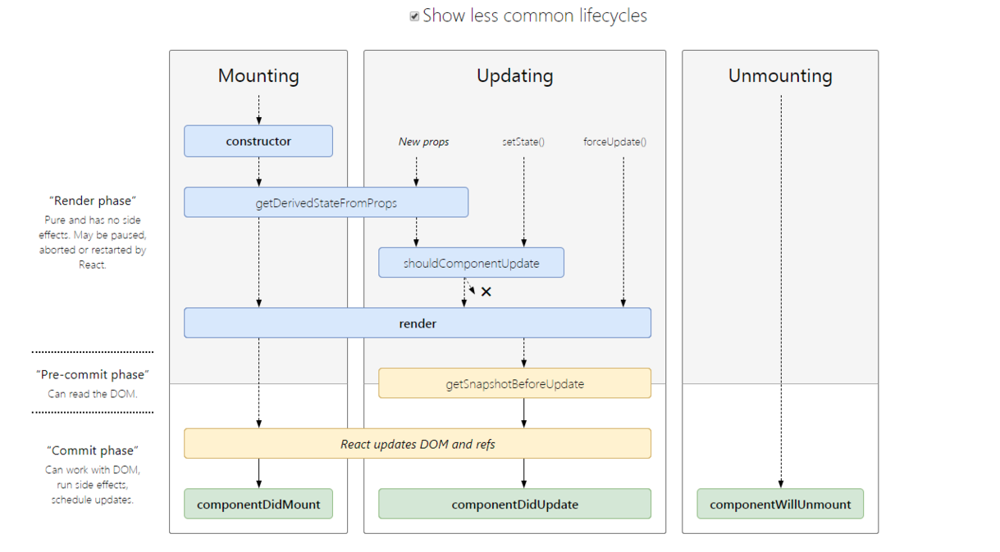
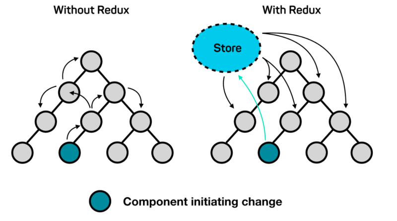

# React

[React 文档学习笔记](https://juejin.im/post/5d372c53e51d4555fc1acd68)

## 最新的生命周期

[查看 React 生命周期图](http://projects.wojtekmaj.pl/react-lifecycle-methods-diagram/) React 16 之后有三个生命周期将被废弃（但并未删除）

- componentWillMount
- componentWillReceiveProps
- componentWillUpdate

> 官方计划在 17 版本完全删除这三个函数，只保留 UNSAVE_前缀的三个函数，目的是为了向下兼容，但是对于开发者而言应该尽量避免使用它们，而是使用新增的生命周期函数替代它们

目前 React 16.8 +的生命周期分为三个阶段，分别是挂载阶段、更新阶段、卸载阶段

**挂载阶段：**

- constructor: 构造函数，最先被执行，我们通常在构造函数里初始化 state 对象或者给自定义方法绑定 this
- getDerivedStateFromProps: static getDerivedStateFromProps(nextProps, prevState), 这是个静态方法，当我们接收到新的属性想去修改我们 state，可以使用 getDerivedStateFromProps
- render: render 函数是纯函数，只返回需要渲染的东西，不应该包含其它的业务逻辑，可以返回原生的 DOM、React 组件、Fragment、Portals、字符串和数字、Boolean 和 null 等内容
- componentDidMount: 组件装载之后调用，此时我们可以获取到 DOM 节点并操作，比如对 canvas，svg 的操作，服务器请求，订阅都可以写在这个里面，但是记得在 componentWillUnmount 中取消订阅

**更新阶段：**

- getDerivedStateFromProps: 此方法在更新跟挂载阶段都可能会调用
- shouldComponentUpdate: shouldComponentUpdate(nextProps, nextState), 有两个参数 nextProps 和 nextState，表示新的属性和变化之后的 state，返回一个布尔值，true 表示会触发重新渲染，false 表示不会触发重新渲染，默认返回 true, 我们通常利用此生命周期来优化 React 程序性能
- render: 更新阶段也会触发此生命周期
- getSnapshotBeforeUpdate: getSnapshotBeforeUpdate(prevProps, prevState), 这个方法在 render 之后，componentDidUpdate 之前调用，有两个参数 prevProps 和 prevState，表示之前的属性和之前的 state，这个函数有一个返回值，会作为第三个参数传给 componentDidUpdate，如果你不想要返回值，可以返回 null，此生命周期必须与 componentDidUpdate 搭配使用
- componentDidUpdate: componentDidUpdate(prevProps, prevState, snapshot), 该方法在 getSnapshotBeforeUpdate 方法之后被调用，有三个参数 prevProps，prevState，snapshot，表示之前的 props，之前的 state，和 snapshot。第三个参数是 getSnapshotBeforeUpdate 返回的，如果触发某些回调函数时需要用到 DOM 元素的状态，则将对比或计算的过程迁移至 getSnapshotBeforeUpdate，然后在 componentDidUpdate 中统一触发回调或更新状态。

**卸载阶段：**

- componentWillUnmount: 当我们的组件被卸载或者销毁了就会调用，我们可以在这个函数里去清除一些定时器，取消网络请求，清理无效的 DOM 元素等垃圾清理工作



## 请求应该放在哪个生命周期中？
React 的异步请求到底应该放在哪个生命周期里，有人认为在 componentWillMount 中可以提前进行异步请求，避免白屏，其实这个观点是有问题的。

由于 JavaScript 中异步事件的性质，当启动 API 调用时，浏览器会在此期间返回执行其他工作。当 React 渲染一个组件时，它不会等待 componentWillMount 它完成任何事情 - React 继续前进并继续 render, 没有办法“暂停”渲染以等待数据到达。

而且在 componentWillMount 请求会有一系列潜在的问题，首先，在服务器渲染时，如果在 componentWillMount 里获取数据，fetch data 会执行两次，一次在服务端一次在客户端，这造成了多余的请求，其次，在 React 16 进行 React Fiber 重写后，componentWillMount 可能在一次渲染中多次调用。

> react 17 之后 componentWillMount 会被废弃，仅仅保留 UNSAFE_componentWillMount

目前官方推荐的异步请求是在 componentDidmount 中进行。

如果有特殊需求需要提前请求，也可以在特殊情况下在 constructor 中请求。

## setState 到底是异步还是同步？

`setState` 在 React 中是经常使用的一个 API，但是它存在一些问题，可能会导致犯错，核心原因就是因为这个 API **有时表现出异步，有时表现出同步**。

1. setState 只在合成事件和钩子函数中是“异步”的，在原生事件和 setTimeout 中都是同步的。
2. setState 的“异步”并不是说内部由异步代码实现，其实本身执行的过程和代码都是同步的，只是合成事件和钩子函数的调用顺序在更新之前，导致在合成事件和钩子函数中没法立马拿到更新后的值，形成了所谓的“异步”，当然可以通过第二个参数 setState(partialState, callback) 中的 callback 拿到更新后的结果。
  ```js
    handle() {
      this.setState((prevState) => ({ count: prevState.count + 1 }), () => {
          console.log(this.state)
      })
    }
  ```
3. setState 的批量更新优化也是建立在“异步”（合成事件、钩子函数）之上的，在原生事件和 setTimeout 中不会批量更新，在“异步”中如果对同一个值进行多次 setState，setState 的批量更新策略会对其进行覆盖，取最后一次的执行，如果是同时 setState 多个不同的值，在更新时会对其进行合并批量更新。

```js
handle() {
  // 初始化 `count` 为 0
  console.log(this.state.count) // -> 0
  this.setState({ count: this.state.count + 1 })
  console.log(this.state.count) // -> 0
}
```
> - 两次的打印都为 0，因为 `setState` 是个 "异步 API"，只有同步代码运行完毕才会执行。`setState` 异步的原因我认为在于，`setState` 可能会导致 DOM 的重绘，如果调用一次就马上去进行重绘，那么调用多次就会造成不必要的性能损失。设计成异步的话，就可以将多次调用放入一个队列中，在恰当的时候统一进行更新过程。
> - 虽然调用了三次 `setState` ，但是最终 `count` 的值还是为 1。因为多次调用会合并为一次，只有当更新结束后 `state` 才会改变，三次调用等同于如下代码
> ```js
>     Object.assign(
>       {},
>       { count: this.state.count + 1 },
>       { count: this.state.count + 1 }
>     )
> ```

## React 组件通信如何实现？

React 组件间通信方式：

- 父组件向子组件通讯：父组件可以向通过传递 props 的方式向子组件进行通讯
- 子组件向父组件通讯：props+回调的方式，父组件向子组件传递的 props 中有作用域为父组件自身的函数方法，然后子组件调用该函数，将子组件想要传递的信息，作为参数，传递到父组件的作用域中
- 兄弟组件通信：找到这两个兄弟节点共同的父节点，结合上面两种方式由父节点转发信息进行通信
- 跨层级通信：Context 设计目的是为了共享那些对于一个组件树而言是“全局”的数据，例如当前认证的用户、主题或首选语言，对于跨越多层的全局数据通过 Context 通信再适合不过
- 发布订阅模式：发布者发布事件，订阅者监听事件并做出反应，我们可以通过引入 event 模块进行通信
- 全局状态管理工具：借助 Redux 或者 Mobx 等全局状态管理工具进行通信，这种工具会维护一个全局状态中心 Store, 并根据不同的事件产生新的状态



## 如何理解 Fiber 及 Time Slice 的？

**React Fiber 是一种基于浏览器的单线程调度算法：**

React 16 之前 ，`reconcilation` 算法实际上是递归，想要中断递归是很困难的。如果你拥有一个很复杂的复合组件，然后改动了最上层组件的 `state`，那么调用栈可能会很长。调用栈过长，再加上中间进行了复杂的操作，就可能导致长时间阻塞主线程，带来不好的用户体验。

在 React V16 版本中引入了 Fiber 机制使用循环来代替之前的递归算法来解决这个问题。这个机制在一定程度上的影响了部分生命周期的调用，并且也引入了新的 2 个 API 来解决问题。

**`Fiber`：一种将 `recocilation` （递归 diff），拆分成无数个小任务的算法；它随时能够停止，恢复。停止恢复的时机取决于当前的一帧（16ms）内，还有没有足够的时间允许计算。**

**Time Slice 时间分片：** 


Fiber 本质上是一个虚拟的堆栈帧，新的调度器会按照优先级自由调度这些帧，从而将之前的同步渲染改成了异步渲染，在不影响体验的情况下去分段计算更新。时间分片正是基于可随时打断、重启的 Fiber 架构，可打断当前任务，优先处理紧急且重要的任务，保证页面的流畅运行。

> 对于如何区别优先级，React 有自己的一套逻辑。
>
> 1. 对于动画这种实时性很高的东西，也就是 16 ms 必须渲染一次保证不卡顿的情况下，React 会每 16 ms（以内） 暂停一下更新，返回来继续渲染动画
> 2. 根据事件类型来。打个比方，点击事件、用户输入事件，相比滚动事件的优先级要高 。目前 React 内部事件机制有简单区分优先级
> 3. 人工提示 React。参考实验版本里面的 useTransition，useDeferredValue  
> 4. 隐藏内容的更新优先级最低。这通常也需要提示 React 指定组件是隐藏的，目前没有公开 API

> 推荐阅读：[这可能是最通俗的 React Fiber（时间分片） 打开方式](https://juejin.im/post/5dadc6045188255a270a0f85) 

## redux 的工作流程？

首先，我们看下几个核心概念：

- Store：保存数据的地方，你可以把它看成一个容器，整个应用只能有一个 Store。
- State：Store 对象包含所有数据，如果想得到某个时刻的数据，就要对 Store 生成快照，这种某个时刻快照的数据集合，就叫做 State。
- Action：State 的变化，会导致 View 的变化。但是，用户接触不到 State，只能接触到 View。所以，State 的变化必须是 View 导致的。Action 就是 View 发出的通知，表示 State 应该要发生变化了。
- Action Creator：View 要发送多少种消息，就会有多少种 Action。如果都手写，会很麻烦，所以我们定义一个函数来生成 Action，这个函数就叫 Action Creator。
- Reducer：Store 收到 Action 以后，必须给出一个新的 State，这样 View 才会发生变化。这种 State 的计算过程就叫做 Reducer。Reducer 是一个函数，它接受 Action 和当前 State 作为参数，返回一个新的 State。
- dispatch：是 View 发出 Action 的唯一方法。

然后我们过下整个工作流程：

1. 首先，用户（通过 View）发出 Action，发出方式就用到了 dispatch 方法。
2. 然后，Store 自动调用 Reducer，并且传入两个参数：当前 State 和收到的 Action，Reducer 会返回新的 State
3. State 一旦有变化，Store 就会调用监听函数，来更新 View。

到这儿为止，一次用户交互流程结束。可以看到，在整个流程中数据都是单向流动的，这种方式保证了流程的清晰。


## react-redux 是如何工作的？

- Provider: Provider 的作用是从最外部封装了整个应用，并向 connect 模块传递 store
- connect: 负责连接 React 和 Redux
  - 获取 state: connect 通过 context 获取 Provider 中的 store，通过 store.getState() 获取整个 store tree 上所有 state
  - 包装原组件：将 state 和 action 通过 props 的方式传入到原组件内部 wrapWithConnect 返回一个 ReactComponent 对象 Connect，Connect 重新 render 外部传入的原组件 WrappedComponent，并把 connect 中传入的 mapStateToProps, mapDispatchToProps 与组件上原有的 props 合并后，通过属性的方式传给 WrappedComponent
  - 监听 store tree 变化：connect 缓存了 store tree 中 state 的状态，通过当前 state 状态和变更前 state 状态进行比较，从而确定是否调用`this.setState()`方法触发 Connect 及其子组件的重新渲染


## redux 与 mobx 的区别？

**两者对比：**

- redux 将数据保存在单一的 store 中，mobx 将数据保存在分散的多个 store 中
- redux 使用 plain object 保存数据，需要手动处理变化后的操作；mobx 适用 observable 保存数据，数据变化后自动处理响应的操作
- redux 使用不可变状态，这意味着状态是只读的，不能直接去修改它，而是应该返回一个新的状态，同时使用纯函数；mobx 中的状态是可变的，可以直接对其进行修改
- mobx 相对来说比较简单，在其中有很多的抽象，mobx 更多的使用面向对象的编程思维；redux 会比较复杂，因为其中的函数式编程思想掌握起来不是那么容易，同时需要借助一系列的中间件来处理异步和副作用
- mobx 中有更多的抽象和封装，调试会比较困难，同时结果也难以预测；而 redux 提供能够进行时间回溯的开发工具，同时其纯函数以及更少的抽象，让调试变得更加的容易

**场景辨析：**

基于以上区别，我们可以简单得分析一下两者的不同使用场景。

mobx 更适合数据不复杂的应用：mobx 难以调试，很多状态无法回溯，面对复杂度高的应用时，往往力不从心。

redux 适合有回溯需求的应用：比如一个画板应用、一个表格应用，很多时候需要撤销、重做等操作，由于 redux 不可变的特性，天然支持这些操作。

mobx 适合短平快的项目：mobx 上手简单，样板代码少，可以很大程度上提高开发效率。

当然 mobx 和 redux 也并不一定是非此即彼的关系，你也可以在项目中用 redux 作为全局状态管理，用 mobx 作为组件局部状态管理器来用。

## redux 中如何进行异步操作？

当然，我们可以在`componentDidmount`中直接进行请求无须借助 redux。

但是在一定规模的项目中，上述方法很难进行异步流的管理，通常情况下我们会借助 redux 的异步中间件进行异步处理。

redux 异步流中间件其实有很多，但是当下主流的异步中间件只有两种 redux-thunk、redux-saga，当然 redux-observable 可能也有资格占据一席之地。
